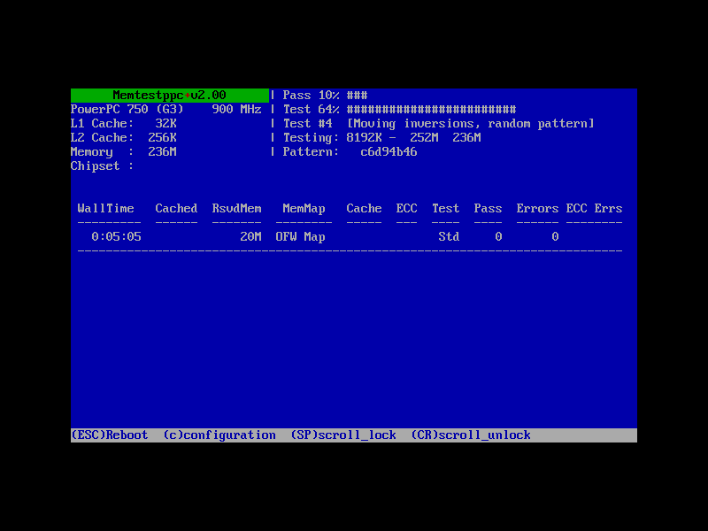

# Memtestppc+

A standalone, bootable RAM tester for PowerPC Macs — a faithful, line-by-line
port of [memtest86+](https://github.com/memtest86plus/memtest86plus/) **v2.00**
to Open Firmware. It boots with **no operating system**, so the maximum fraction
of system memory is under test. Same blue-screen TUI, IBM VGA 8x16 font, and
green title bar — plus the runtime configuration menu.



_vibe-coded with Claude _

## How to use it

Two methods:

### Boot the CD-ROM

Burn and boot [memtestppc.iso](https://github.com/cellularmitosis/memtestppc/releases/download/v2.00/memtestppc.iso) (hold the `c` key at the startup chime)

### Use OpenFirmware

- Copy the [ELF binary](https://github.com/cellularmitosis/memtestppc/releases/download/v2.00/memtest) to your hard drive as `/memtest` (right beside `/mach_kernel`)
- Boot into OpenFirmware (hold option + command + `o` + `f` at the startup chime)
- Enter `boot hd:3,memtest` if using the first partition, `boot hd:5,memtest` if using the second partition, etc.
- Note: this is just a single-shot.  When you reboot, OpenFirware will resume using `/mach_kernel` and boot into Tiger/Leopard.


## Status

**v2.00 — a faithful, line-by-line port of memtest86+ v2.00.** Boots and runs
end-to-end on real iBook G3 hardware — from a **burned CD-R**, from an HFS+
partition, and as a QEMU `-cdrom` image. The full v2.00 test suite cycles with
`Errors: 0` on good RAM, the TUI and runtime config menu render and respond, and
CPU / clock / cache / memory all come from Open Firmware.

| Surface | Status | Notes |
|---|---|---|
| memtest86+ v2.00 test suite | ✅ Working | Address, moving-inversions, block-move, modulo-20, and random tests cycle; `Errors: 0` on good RAM. |
| Run on real iBook G3 | ✅ Working | Boots + runs via Open Firmware (`/memtest`, `boot hd:3,memtest`); PowerPC 750, the 900 MHz iBook. |
| Boot from CD image in QEMU (mac99) | ✅ Working | Via a CHRP boot script; needs ≥128 MB RAM under OpenBIOS. |
| Physical CD boot | ✅ Working | Burned CD-R boots on a real iBook G3. genisoimage HFS hybrid: DDM+APM+blessed `tbxi` (`ofboot.b`) with a `<COMPATIBLE>` block for New World OF. |
| TUI rendering (VGA font, colors, layout) | ✅ Working | Embedded IBM VGA 8x16 font rendered to the OF framebuffer. |
| 8-bit framebuffer + palette | ✅ Working | Real iBook G3 (ATI Rage Mobility); Apple OF `color!` palette setup. |
| 32-bit framebuffer path | ✅ Working | QEMU's mac99 framebuffer. |
| CPU id (PVR → G3/G4/G5) + clock/cache | ✅ Working | CPU name from the PVR; clock and cache sizes from the OF device tree. |
| Memory discovery + claim | ✅ Working | OF `/memory` + `ofw_claim` in 1 MB chunks (~244 MB of 256 on the iBook). |
| Runtime config menu (`c`) | ✅ Working | Test Selection / Address Range / Error Report Mode / Restart / Refresh, driven by OF console keys. |
| Error display (white-on-red) | 🟡 Partial | Full-row red verified in QEMU; not yet triggered on real 8-bit hardware (no errors seen there yet). |
| Bit-fade test | 🟡 Partial | `sleep()` runs off the OF timebase; selected-only (not in the default pass), so its ~90-min dwell never runs by default. |

## Building & running

Requires a `powerpc-linux-gnu` cross toolchain, `qemu-system-ppc`, and
`genisoimage` (all on a Linux host; Tiger's own gcc can't produce the ELF that
Open Firmware needs).

```sh
make memtestppc.iso

# Run in QEMU (mac99; 128 MB+ is required for OpenBIOS auto-boot):
qemu-system-ppc -M mac99 -m 256 -cdrom memtestppc.iso -boot d
```

On a real PowerPC Mac, burn `memtestppc.iso` to a CD-R (e.g.
`wodim -dao -eject dev=/dev/sr0 memtestppc.iso`) and hold **C** at the startup
chime, or boot it from the Open Firmware prompt with `boot cd:,\\:tbxi`.
Alternatively, copy `memtestppc.elf` to an HFS+ partition and
`boot hd:N,memtestppc.elf`.

## Layout

```
src/        — the v2.00 port: head.S, ofw, display, lib, screen_buffer, random,
              init, memsize, error, test, config, patn, main (+ test.h,
              config.h, font_vga.h, ppc.h, linker.ld).
cd/         — boot script (ofboot.b) + HFS type map (hfs.map) for the ISO.
ref/        — memtest86+ v2.00 source (the port's base) + v5.01 + screenshots.
docs/       — project plan and per-session notes (docs/sessions/).
Makefile    — cross-compile, ISO build, QEMU targets.
```

## License

GPL v2, inherited from memtest86+ (Chris Brady and Samuel Demeulemeester). The
PowerPC / Open Firmware port code is GPL v2 to match.
