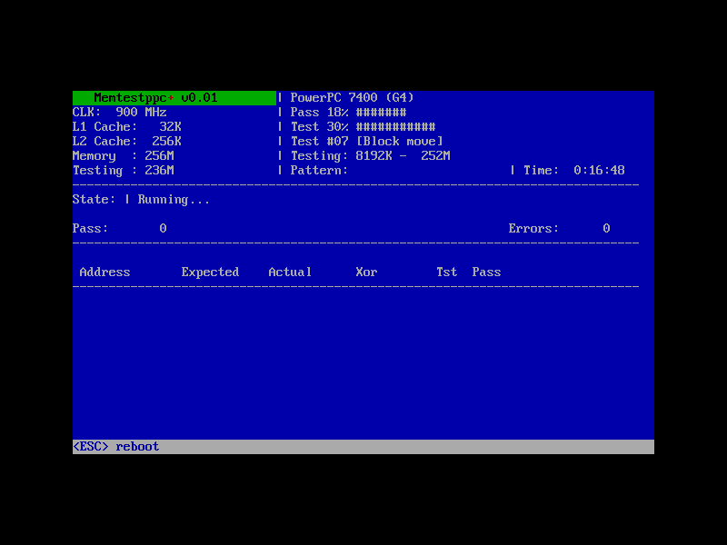

# Memtestppc+

A standalone, bootable RAM tester for PowerPC Macs — a WIP port of the
classic [memtest86+](https://github.com/memtest86plus/memtest86plus/) v5.01 blue-screen TUI to Open Firmware.
It boots with **no operating system**, so the maximum fraction of
system memory is under test. Same IBM VGA 8x16 font, same green title bar, same
blinking `+`.



_vibe-coded with Claude _

## How to use it

Two methods:

### Boot the CD-ROM

Burn and boot [memtestppc.iso](artifacts/memtestppc.iso) (hold the `c` key at the startup chime)

### Use OpenFirmware

- Copy the [ELF binary](artifacts/memtest) to your hard drive as `/memtest` (right beside `/mach_kernel`)
- Boot into OpenFirmware (hold option + command + `o` + `f` at the startup chime)
- Enter `boot hd:3,memtest` if using the first partition, `boot hd:5,memtest` if using the second partition, etc.
- Note: this is just a single-shot.  When you reboot, OpenFirware will resume using `/mach_kernel` and boot into Tiger/Leopard.


## Status

**Early, pre-release (v0.01).** Boots and runs end-to-end on real iBook G3
hardware — from a **burned CD-R**, from an HFS+ partition, and as a QEMU `-cdrom`
image. The TUI renders correctly, memory is discovered and tested, progress bars
and timer work. Not yet packaged for download. No releases yet.

| Surface | Status | Notes |
|---|---|---|
| Boot from CD image in QEMU (mac99) | ✅ Working | Via a CHRP boot script; needs ≥128 MB RAM under OpenBIOS. |
| Run on real iBook G3 | ✅ Working | Booted from an HFS+ partition via Open Firmware. |
| TUI rendering (VGA font, colors, layout) | ✅ Working | Embedded IBM VGA 8x16 font rendered to the OF framebuffer. |
| 32-bit framebuffer path | ✅ Working | QEMU's mac99 framebuffer. |
| 8-bit framebuffer + palette | ✅ Working | Real iBook G3 (ATI Rage Mobility); Apple OF `color!` palette setup. |
| CPU identification (PVR → G3/G4/G5) | ✅ Working | Plus cache sizes from the OF device tree. |
| Memory discovery + test | ✅ Working | Claims RAM from OF in 1 MB chunks (~244 MB of 256 on the iBook). |
| Error display (white-on-red) | 🟡 Partial | Full-row red verified in QEMU; not yet seen on real 8-bit hardware. |
| Bit-fade test (test 11) | 🟡 Partial | Runs, but the timed fade window is stubbed out (no `sleep()` yet). |
| Physical CD boot | ✅ Working | Burned CD-R boots on a real iBook G3. genisoimage HFS hybrid: DDM+APM+blessed `tbxi` boot script (`ofboot.b`) with a `<COMPATIBLE>` block for New World OF. |

## Building & running

Requires a `powerpc-linux-gnu` cross toolchain, `qemu-system-ppc`, and
`genisoimage` (all on a Linux host; Tiger's own gcc can't produce the ELF that
Open Firmware needs).

```sh
make memtestppc.iso

# Run in QEMU (mac99; 128 MB+ is required for OpenBIOS auto-boot):
qemu-system-ppc -M mac99 -m 256 -cdrom memtestppc.iso -boot d
```

On a real PowerPC Mac, burn `memtestppc.iso` to a CD-R (e.g.
`wodim -dao -eject dev=/dev/sr0 memtestppc.iso`) and hold **C** at the startup
chime, or boot it from the Open Firmware prompt with `boot cd:,\\:tbxi`.
Alternatively, copy `memtestppc.elf` to an HFS+ partition and
`boot hd:N,memtestppc.elf`.

## Layout

```
src/        — the port: head.S, ofw.{c,h}, display.{c,h}, font_vga.h,
              memtest.h, test.c, main.c, linker.ld.
cd/         — CHRP bootinfo.txt for the bootable ISO.
ref/        — memtest86+ v5.01 reference source + screenshots.
docs/       — project plan and per-session notes (docs/sessions/).
Makefile    — cross-compile, ISO build, QEMU targets.
```

## License

GPL v2, inherited from memtest86+ (Chris Brady and Samuel Demeulemeester). The
PowerPC / Open Firmware port code is GPL v2 to match.
